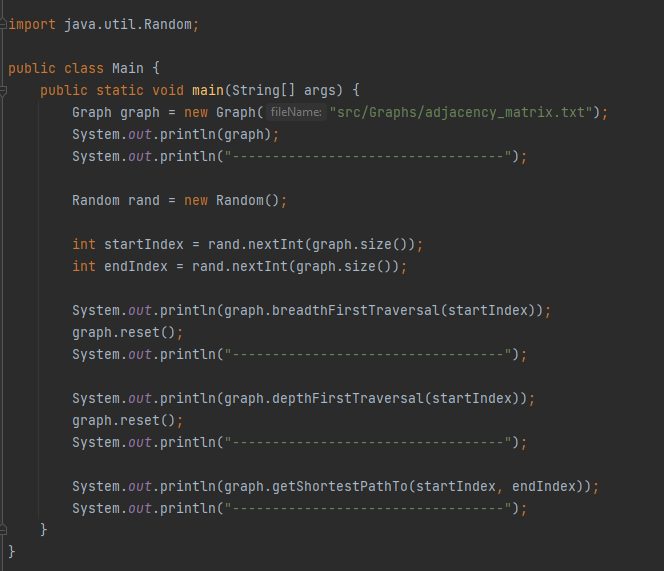
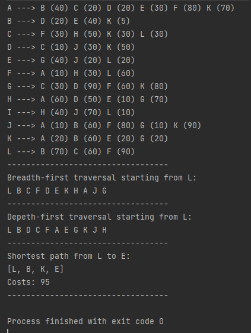

<h2>Graph ADT implemented in Java</h2>
<h5>Implementations:</h5>
<ul>
    <li>A graph created from an adjacency Matrix .txt file</li>
    <li>Depth First traversal</li>
    <li>Breadth First traversal</li>
    <li>Dijkstra's algorithm (Shortest path)</li>

</ul>

<h3>Sample main method:</h3>

<h3>Output:</h3>

